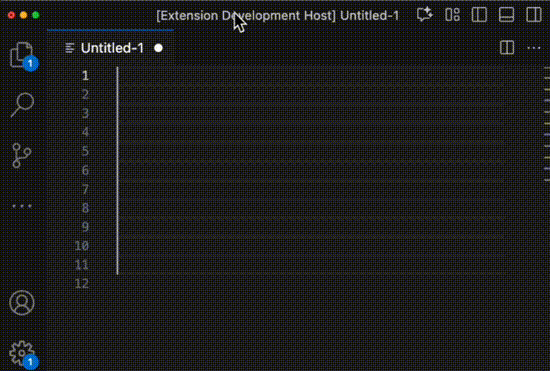
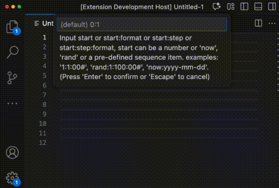
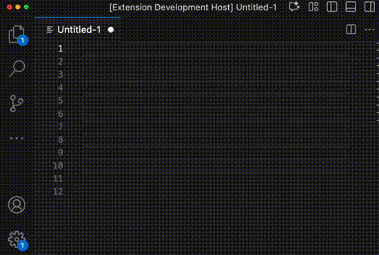
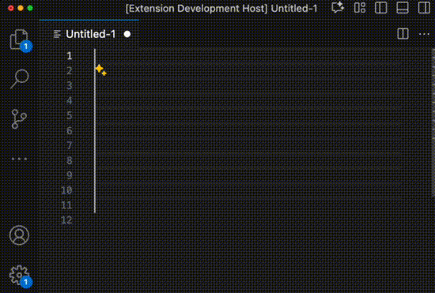
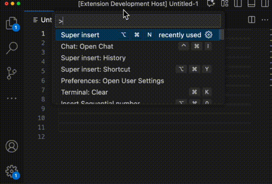
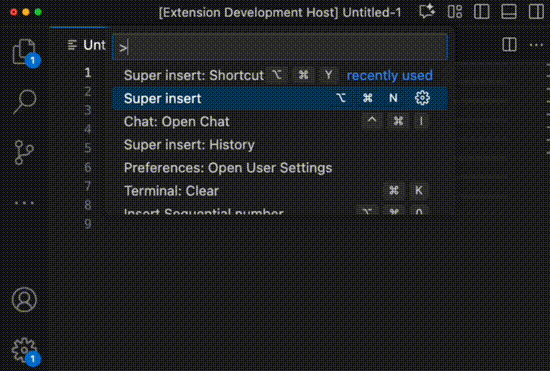
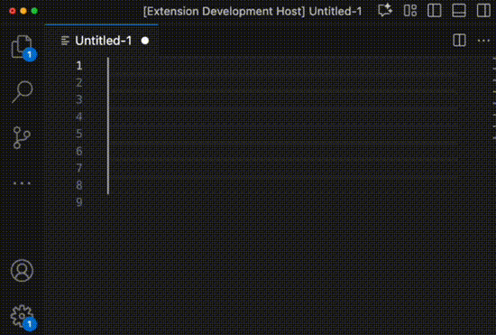
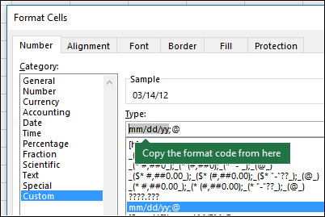

# README

## Super Insert for Visual Studio Code

An extension to insert sequences, numbers or dates.

## Why another `insert numbers` extension?

There are already quite a few extensions with similar features, but I prefer Excel’s formatting approach — it’s more intuitive, especially for non-programmers.

Furthermore, those extensions is not easy to extend, especially If I only want to insert same simple fixed sequences, e.g. Monday/Thuesday etc.

So I created my own tool. It supports:

- Excel-like format
- Add custom sequences by only configuring with vscode settings
- Random numbers
- Dates

## Usage

- Command: `Super insert` - Insert sequences, numbers or dates
  - Keybindings: `(ctrl|cmd)+alt+n`
  - Basic numbers

    
  - Decimals/Fraction numbers

    
  - Random numbers

    
  - Dates

    
  - Sequences

    

- Command: `Super insert: Shortcut` - Do the insertion with predefined shortcuts
  - Keybindings: `(ctrl|cmd)+alt+y`

    

- Command: `Super insert: History` - Do the insertion from input history, allows editing before run.

    

## Input

| Usage    | Input                                    | Example           | Output           | Notes                                                                                                                            |
|----------|------------------------------------------|-------------------|------------------|----------------------------------------------------------------------------------------------------------------------------------|
| Numbers  | \<start\>:\<step\>:\<format\>                | 1:1:00#           | 001              | formats documented in the following sections                                                                                     |
|          |                                          | 1:00#             | 001              | Default step is 1                                                                                                                |
|          |                                          | 1                 | 1                | Default step is 1                                                                                                                |
|          |                                          |                   | 0                | Default start is 0, default step is 1                                                                                            |
| Randoms  | (rand\|random):<br/>\<min\>:\<max\>:\<format\>| rand:1:100:#      | 32               | Generate random numbers between 1 and 100, output with format #                                                                  |
|          |                                          | rand:1:100        | 32.0225... | Generate random numbers between 1 and 100, output raw numbers                                                                    |
|          |                                          | rand:100          | 32.0225... | Generate random numbers between 0 and 100, output raw numbers                                                                    |
|          |                                          | rand              | 0.225...   | Generate random numbers between 0 and 1, output raw numbers                                                                      |
| Dates    | (now\|today):<br/>\<step\>:\<format\>         | now:1d:yyyy-mm-dd | 2025-09-19       | step can be numbers as seconds, or can be numbers with one of "dhms", e.g. d for days, h for hours, m for minutes, s for seconds |
|          |                                          | now:yyyy-mm-dd    | 2025-09-19       | Default step is 1d                                                                                                               |
|          |                                          | yyyy-mm-dd        | 2025-09-19       | Default step is 1d                                                                                                               |
| Sequence | (one of the <br/>pre- or custom-defined <br/>sequence item)   | Monday            | Monday Tuesday … | There are built-in sequences or user defined sequences                                                                           |

## Format

The format is controlled by a Excel cell format string, i.e. excel's TEXT function.



More please consult [examples](http://download.microsoft.com/download/6/A/8/6A818B0B-06F4-4E41-80DE-D383A3B89865/TEXT%20function%20examples.xlsx) given in the [Excel text function documentation](https://support.microsoft.com/en-us/office/text-function-20d5ac4d-7b94-49fd-bb38-93d29371225c).

### Some of the Number format

| Symbol | Inerpretation                                                                                       |
|--------|-----------------------------------------------------------------------------------------------------|
| #      | A # is a placeholder for a digit, but it will not display if there are no digits to fill that place |
| 0      | A 0 forces to display a digit in that position, even if it is a leading or trailing zero.           |
| %      | A percent makes the value to be a percentage, e.g. 1 to be 100%                                     |
| ,      | comma, numeric seperator, to make the result separate thousands                                     |
| .      | decimal separator                                                                                   |
| /      | fraction seperator                                                                                  |

Exampes:

| Original | Fixed |      |         |        |       |       |                     |                     | Fraction |        |          |
|----------|-------|------|---------|--------|-------|-------|---------------------|---------------------|----------|--------|----------|
|          | #     | 0    | 0.00    | 00.0   | #.##  | 0.##  | 0,0.##<br/>#,#00.## | #,#.##<br/>#,###.## | #/#      | # #/#  | # #/40   |
| 4000     | 4000  | 4000 | 4000.00 | 4000.0 | 4000. | 4000. | 4,000.              | 4,000.              | 4000/1   | 4000   | 4000     |
| -8.8     | -9    | -9   | -8.80   | -08.8  | -8.8  | -8.8  | -08.8               | -8.8                | -44/5    | -8 4/5 | -8 32/40 |
| -5.6     | -6    | -6   | -5.60   | -05.6  | -5.6  | -5.6  | -05.6               | -5.6                | -28/5    | -5 3/5 | -5 24/40 |
| -2.4     | -2    | -2   | -2.40   | -02.4  | -2.4  | -2.4  | -02.4               | -2.4                | -12/5    | -2 2/5 | -2 16/40 |
| 0.8      | 1     | 1    | 0.80    | 00.8   | .8    | 0.8   | 00.8                | .8                  | 4/5      | 4/5    | 32/40    |
| 4        | 4     | 4    | 4.00    | 04.0   | 4.    | 4.    | 04.                 | 4.                  | 4/1      | 4      | 4        |
| 7.2      | 7     | 7    | 7.20    | 07.2   | 7.2   | 7.2   | 07.2                | 7.2                 | 36/5     | 7 1/5  | 7 8/40   |

| Original | Thousand and Percent |          |           | As Literal         |        | Scientific |          |         | Literals |           |        |
|----------|----------------------|----------|-----------|--------------------|--------|------------|----------|---------|----------|-----------|--------|
|          | #,k                  | #.#%     | #,0.#%    | ,#.#-,<br/>,,#.#-, | \%#.#  | 0.00E+00   | 0.00E+00 | ##.#E-0 | #\-#.#   | #"abc"#.# | #中#.#  |
| 4000     | 4k                   | 400000.% | 400,000.% | ,4000.-,           | %4000. | 4.00E+3    | 4.00E3   | 40.E2   | 400-0.   | 400abc0.  | 400中0. |
| -8.8     | -k                   | -880.%   | -880.%    | -,8.8-,            | -%8.8  | -8.80E+0   | -8.80E0  | -8.8E0  | --8.8    | -abc8.8   | -中8.8  |
| -5.6     | -k                   | -560.%   | -560.%    | -,5.6-,            | -%5.6  | -5.60E+0   | -5.60E0  | -5.6E0  | --5.6    | -abc5.6   | -中5.6  |
| -2.4     | -k                   | -240.%   | -240.%    | -,2.4-,            | -%2.4  | -2.40E+0   | -2.40E0  | -2.4E0  | --2.4    | -abc2.4   | -中2.4  |
| 0.8      | k                    | 80.%     | 80.%      | ,.8-,              | %.8    | 8.00E-1    | 8.00E-1  | 80.E-2  | -.8      | abc.8     | 中.8    |
| 4        | k                    | 400.%    | 400.%     | ,4.-,              | %4.    | 4.00E+0    | 4.00E0   | 4.E0    | -4.      | abc4.     | 中4.    |
| 7.2      | k                    | 720.%    | 720.%     | ,7.2-,             | %7.2   | 7.20E+0    | 7.20E0   | 7.2E0   | -7.2     | abc7.2    | 中7.2   |

Counting time examples: e.g. how may hours or minutes for n dates, n is the input number:

| Original |       |         |         |           |
|----------|-------|---------|---------|-----------|
|          | [h]   | [m]     | [h] m   | [h] m s   |
| 4000     | 96000 | 5760000 | 96000 0 | 96000 0 0 |
| -8.8     | -211  | -12672  | -212 48 | -212 48 0 |
| -5.6     | -134  | -8064   | -135 36 | -135 36 0 |
| -2.4     | -57   | -3456   | -58 24  | -58 24 0  |
| 0.8      | 19    | 1152    | 19 12   | 19 12 0   |
| 4        | 96    | 5760    | 96 0    | 96 0 0    |
| 7.2      | 172   | 10368   | 172 48  | 172 48 0  |

> Note: Some versions of Excel will output "#####..." for negative numbers with format "[h] m" and "[h] m s"

### Conditional format

Conditions can be specified in square brackets, like this: `[<comparator> <numberic constant>]<format>`, e.g. `[>3]#` (means value greater than 3 will be output as integer, that is 3.1 will be converted to "3", but 1.1 will remains "1.1"), which is called conditional format.

A format can contain multiple conditional formats, seperated by semi-colon. e.g. `[>3]#;[<2]#.#;0.00` means value greater than 3 will use `#` format, less than 2 will use `#.#`, and others `0.00`.

comparator listed below:

| comparator | meaning                           | notes                  |
|------------|-----------------------------------|------------------------|
| <>         | not equal                         |                        |
| <=         | less than or equal                |                        |
| <          | less than                         |                        |
| >=         | greater than or equal             |                        |
| >          | greater than                      |                        |
| =          | equal                             |                        |
| %          | mod, 0 for false, others for true | not supported by excel |

Example:

| Original |                    |
|----------|--------------------|
|          | 1.5:0.5:[%1]#;#.#0 |
| 1.5      | 1.50               |
| 2        | 2                  |
| 2.5      | 2.50               |
| 3        | 3                  |
| 3.5      | 3.50               |
| 4        | 4                  |

### Some of the Date format

| Symbol | Inerpretation                                                                                    |
| ------ | ------------------------------------------------------------------------------------------------ |
| d      | day of the month, as a single digit                                                              |
| dd     | two-digit day of the month, possibly with a leading zero                                         |
| ddd    | Abbreviated day of the week, represented by the thee initial letters                             |
| dddd   | Day of the week                                                                                  |
| m      | single digit month number if the last seen symbol was a date part, otherwise single digit minute |
| mm     | two-digit month number if the last seen symbols was a date part, otherwise two-digit minute      |
| mmm    | Abbreviated of the month, represented by the thee initial letters                                |
| mmmm   | Month full name                                                                                  |
| y or yy| Two digit year                                                                                   |
| yyy+   | Four digit year                                                                                  |
| h      | single digit hour                                                                                |
| hh+    | two-digit hour, possibly with leading zero                                                       |
| s      | single digit second                                                                              |
| ss+    | two-digit second                                                                                 |
| A/P    | Instead of 24h time, use 12h with A or P suffix                                                  |
| am/pm  | Use 12h time with AM or PM suffix                                                                |

Examples:

| yyyy/m/d hh\\:mm\\:ss | yyyy-mm-dd hhmmss | ddd, mmm dd - yyyy | dddd, dd of mmmm of yyyy           | m/d/yyyy h\\:mm AM/PM | hham/pm | hh a/p mm |
|---------------------|-------------------|--------------------|------------------------------------|----------------------|---------|-----------|
| 2025/9/3 10:02:00   | 2025-09-03 100200 | Wed, Sep 03 - 2025 | Wednesday, 03 of September of 2025 | 9/3/2025 10:02 AM    | 10am    | 10 a 02   |
| 2025/9/3 19:02:00   | 2025-09-03 190200 | Wed, Sep 03 - 2025 | Wednesday, 03 of September of 2025 | 9/3/2025 7:02 PM     | 07pm    | 07 p 02   |

> Note: colon (:) must be escaped with backslash (\\), because colon is the default seperator in format.

### Pre-defined sequences

| Weekday | Weekday   | Music Symbol | Roman | Astro       | Alphabet |   | 中午周 |   | 中文数字 | 中文数字 | 大写货币 |   | 星座 | 节气 | 天干 | 地支 | 60甲子 | 生物 | 颜色 |
|---------|-----------|--------------|-------|-------------|----------|---|-----|---|------|------|------|---|----|----|----|----|------|----|----|
| Sun     | Sunday    | Do           | I     | Aries       | a        | A | 周日  | 日 | 零    | 零    | 零    | 零 | 白羊 | 立春 | 甲  | 子  | 甲子   | 域  | 红  |
| Mon     | Monday    | Re           | II    | Taurus      | b        | B | 周一  | 一 | 一    | 一    | 壹    | 壹 | 金牛 | 雨水 | 乙  | 丑  | 乙丑   | 界  | 橙  |
| Tue     | Tuesday   | Mi           | III   | Gemini      | c        | C | 周二  | 二 | 二    | 二    | 貳    | 貳 | 双子 | 惊蛰 | 丙  | 寅  | 丙寅   | 门  | 黄  |
| Wed     | Wednesday | Fa           | IV    | Cancer      | d        | D | 周三  | 三 | 三    | 三    | 叁    | 叁 | 巨蟹 | 春分 | 丁  | 卯  | 丁卯   | 纲  | 绿  |
| Thu     | Thursday  | Sol          | V     | Leo         | e        | E | 周四  | 四 | 四    | 四    | 肆    | 肆 | 狮子 | 清明 | 戊  | 辰  | 戊辰   | 目  | 蓝  |
| Fri     | Friday    | La           | VI    | Virgo       | f        | F | 周五  | 五 | 五    | 五    | 伍    | 伍 | 处女 | 谷雨 | 己  | 巳  | 己巳   | 科  | 靛  |
| Sat     | Saturday  | Si           | VII   | Libra       | g        | G | 周六  | 六 | 六    | 六    | 陆    | 陆 | 天秤 | 立夏 | 庚  | 午  | 庚午   | 属  | 紫  |
|         |           |              | VIII  | Scorpio     | h        | H |     |   | 七    | 七    | 柒    | 柒 | 天蝎 | 小满 | 辛  | 未  | 辛未   | 种  |    |
|         |           |              | IX    | Sagittarius | i        | I |     |   | 八    | 八    | 捌    | 捌 | 射手 | 芒种 | 壬  | 申  | 壬申   |    |    |
|         |           |              | X     | Capricorn   | j        | J |     |   | 九    | 九    | 玖    | 玖 | 摩羯 | 夏至 | 癸  | 酉  | 癸酉   |    |    |
|         |           |              |       | Aquarius    | k        | K |     |   | 十    | 十    | 拾    | 拾 | 水瓶 | 小暑 |    | 戌  | 甲戌   |    |    |
|         |           |              |       | Pisces      | l        | L |     |   |      | 百    |      | 佰 | 双鱼 | 大暑 |    | 亥  | 乙亥   |    |    |
|         |           |              |       |             | m        | M |     |   |      | 千    |      | 仟 |    | 立秋 |    |    | 丙子   |    |    |
|         |           |              |       |             | n        | N |     |   |      | 万    |      | 萬 |    | 处暑 |    |    | 丁丑   |    |    |
|         |           |              |       |             | o        | O |     |   |      | 亿    |      | 億 |    | 白露 |    |    | 戊寅   |    |    |
|         |           |              |       |             | …        | … |     |   |      |      |      |   |    | …  |    |    | …    |

> Note: Consult `BuiltInSequences.ts` for more.

## Settings

All settings are under `superinsert` property.

| Setting Key         | type                                                                                                                                                       | Description                                                                                  | default    |
|---------------------|------------------------------------------------------------------------------------------------------------------------------------------------------------|----------------------------------------------------------------------------------------------|------------|
| start               | number                                                                                                                                                     | Will be used when user inputs nothing                                                        | 0          |
| step                | number                                                                                                                                                     | Will be used when user does not input step for numbers                                       | 1          |
| defaultRandomFormat | string                                                                                                                                                     | Will be used when only input 'rand' or 'random'                                              |            |
| defaultDateFormat   | string                                                                                                                                                     | Will be used when only input 'now' or 'today'                                                | yyyy-mm-dd |
| defaultDateStep     | number or string                                                                                                                                           | Will be used when the start is 'now' or 'today', number stands for seconds                   | 1d         |
| defaultLocale       | "en-US" or "zh-CN"                                                                                                                                         | Will be used to control weekday and month name                                               |            |
| customSequences     | {<br/> sequence?: string[],<br/> caseSensitive?: boolean <br/>}[]                                                                                          | Will be used when user wants to input sequence                                               |            |
| shortcuts           | {<br/>    input?: string,<br/>    label?: string,<br/>    format?: string,<br/>    step?: number,<br/>    start?: number,<br/>    locale?: string,<br/>}[] | Will be used when invoke the "Shortcut" command. "locale" is used for weekday and month name |

### customSequences example

```json
"superinsert": {
    "customSequences": [
        {
            "sequence": [
                "风",
                "雷",
                "雨"
            ],
            "caseSensitive": false,
        }
    ],
}
```

### shortcuts example

```json
"superinsert": {
    "shortcuts": [
        {
            "input": "yyyy-MM-dd hh\\:MM\\:ss",
            "label": "date and time"
        },
        {
            "input": "yyyyMMdd",
            "label": "date simple"
        },
        {
            "input": "dddd, dd of mmmm of yyyy",
            "label": "date complex",
            "locale": "zh-CN"
        },
        {
            "input": "rand:1:100:#",
            "label": "random number between 1 and 100"
        },
        {
            "input": "1234:##\\,##",
            "label": "4 digits with comma in the middle"
        }
    ],
}
```

## Development

### Build

This project depends on a [fork repo](https://github.com/QueenKunkun/super-insert.git) of [datadocs/rose-formatter](https://github.com/datadocs/rose-formatter), for customizations.

So I added it as a submodule, to correctly build it, you need to clone and build the submodule as well.

```bash
git clone --recurse-submodules https://github.com/QueenKunkun/super-insert.git
cd super-insert
# build the submodule first
cd rose-formatter
npm i
npm run build

# build this extension
cd ..
npm i
npm run package # or debug directly, more information please see vscode's development guide
```

## Thanks

- [Inori/vscode-InsertNumbers: Insert Numbers extension for vscode](https://github.com/Inori/vscode-InsertNumbers)
- [datadocs/rose-formatter: A port of Excel's numerical formatting...](https://github.com/datadocs/rose-formatter )

## For more information or bug reports

- [GitHub](https://github.com/QueenKunkun/super-insert)
